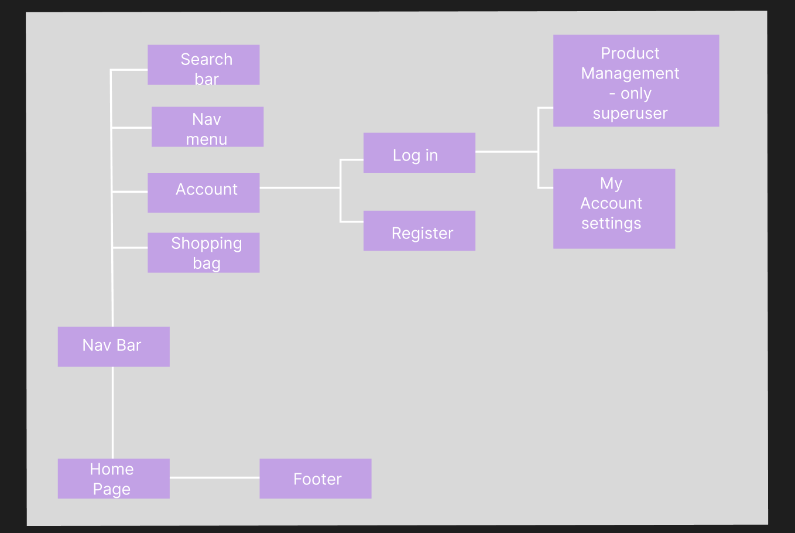
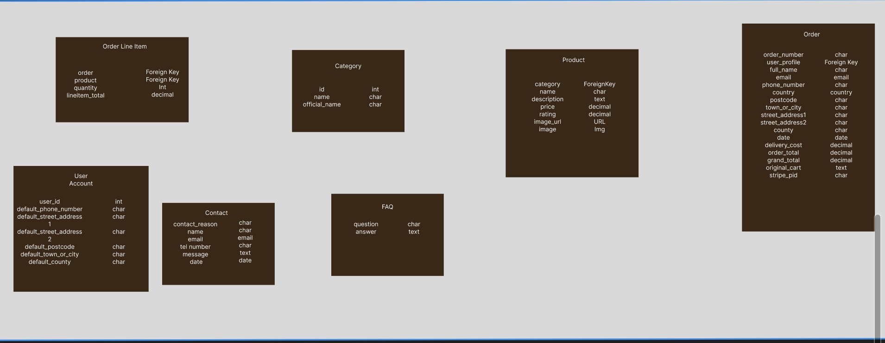
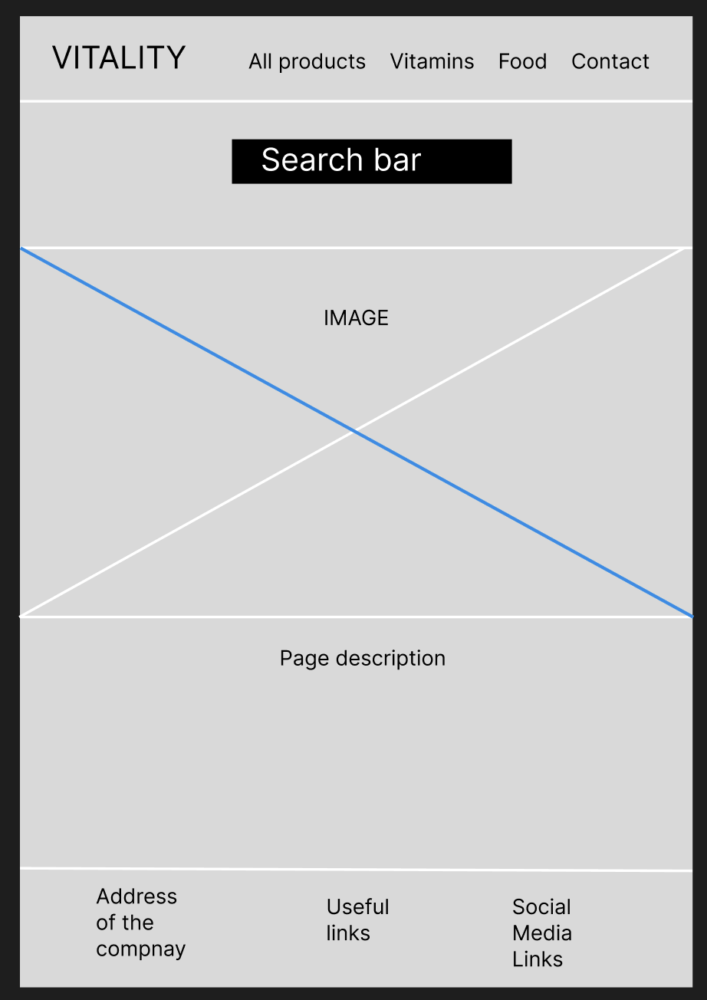

# Vitality

<p>
  
</p>

[Click here to view the live project]
(<https://vitality-milestone-4-38e06b4d04ae.herokuapp.com>)

## Table of contents

1. Introduction
2. UX
   1. User Demographic
   2. User Stories
   3. Development Planes
   4. Design
3. Features
   1. Design Features
   2. Existing Features
   3. Features to Implement in the Future
4. Issues and Bugs
5. Technologies Used
   1. Main Languages Used
   2. Frameworks, Libraries & Programs Used
6. Testing
   1. Testing User Stories
   2. Manual Testing
   3. Automated Testing
   - Code Validation
   - Browser Validation
   4. User Testing
7. Deployment
   1. Deploying on GitHub Pages
8. Credits
   1. Content
   2. Media
   3. Code
9. Acknowledgements

---

## Introduction

The primary goals of Vitality website is to provide a web-based application that is intuitive and easy to navigate, and allows users purchase health supplemets and healthy snacks.

This is the fourth of four Milestone Projects that the developer must complete during their Full Stack Web Development Program at The Code Institute.

The main requirements of this project are to build a responsive, simple site using HTML, CSS, JavaScript, Python, Django.

## UX

### User Demographic

The ideal user for this website is:

- New user
- Returning user
- User

### User-Stories

#### New User

1. As a new user, I want to be able to navigate to Sign-Up page to register an account.

#### Returning User

1. As a returning user, I want to be able to access my account on the website.
2. View my previous orders, to keep a record of my transaction.
3. Edit default information, to update any necessary fields.
4. View shopping bag to get an overview of products I wish to order.
5. Remove products from my bag, as needed.
6. Update a product's quantity, as needed.
7. Proceed to a secure checkout, to complete the purchase.
8. Have clear visual feedback of the order process, to understand all steps of the process.
9. Be able to edit my bag at all times, to allow change of mind.
10. Receive a summary of my order via email to confirm that my transaction has been process.

#### User

1. View all products, to purchase my desired items.
2. Filter through categories, to only see relevant products.
3. Use a search query, to find a specific product or product type.
4. Add items to my shopping bag, to begin the order process.
5. Receive visual feedback that my item has been added to the bag, to confirm my selection.
6. View contact informtation for the shop
7. Navigate to a page that could help me with my enquiry, to answer my question.

### Development-Planes

For the site to function as intended and fulfil its purpose for the user, the developer needs to develop all aspects of a functional web-based application.

#### Strategy

Strategy incorporates user needs as well as product objectives. This website will focus on the following target audience, divided into three main categories:

- **Roles:**

  - New user
  - Returning user
  - User

- **Demographic:**

  - healthy lifestyle
  - shopping intrest
  - teens
  - adults

- **Psychographic:**
  - Any socioeconomic status and age group

The website needs to enable the **user** to:

- Create an account or log in to an existing one
- View past purchases
- Edit/Save Delivery Information
- Get in touch with the shop
- Pay for products
- Choose products to buy

The website needs to enable the **site manager** to:

- Add/deleyte and edit items
- Log in as a superuser toi unlock ceratin features
- Improve the site as necessary with various new features

#### Scope

The scope plane is about defining requirements based on the goals established on the strategy plane. Using the information in the strategy plane.

- Content Requirements:
  - The user will be looking for:
    - Products are visible on the site
    - Visible buttons
    - Intuitive navigation bar
    - Social Media links for those with further interest in the company
   	- View Categories
    - Get feedback from the site
  - The user will be able to:
    - Log in/ Register/ Log out of the website
    - Be able to easily navigate the site to find the information they require, like social media links etc
    - Add products to basket
    - View basket 
    - Checkout shopping
    - Filter and search bar - options to find products user requires

#### Structure

The information above was organized in a hierarchical tree structure, showing how users can navigate through the interactive site with ease and efficiency, with the following results:

<details>

<summary>Structure of the Site</summary>

<p>
  
</p>

</details>

The structure of the models and database is included below :
<summary>Structure of the Database</summary>

<p>
  
</p>

</details>

### Skeleton

Wireframes were made to showcase the appearance of the site pages while keeping a positive user experience in mind. The wireframes were created using an online version of [Figma](https://www.figma.com).

<p>
    
</p>

</details>

### Design

#### Colour Scheme

I have chosen my colour scheme by using [SheCodes](https://palettes.shecodes.io/) colour scheme palettes.
The colours used are :
  
# b45555 - text of the body;
# 000000 - black for text like titles, nav-bar etc;
# c13131 - red for footer links;
# FFFFFF - white for some text and background of some text ;
# c13131 - red for delete button;
# 007bff - blue for edit button
# aab7c4 - light grey for placeholders

White was used as the background colour for the website as graphic is full of colour creating a good contrast for reading and browsing.  
The main content text is in a black shade, as this colour creates the best contrast to guarantee the high readability of the text. Following the standard procedure, the delete buttons are red; the edit buttons are blue.
Shades picked are generally soft with a few contrasting colours like red, black, white and grey to focus the user on colorful products.

#### Typography

The typography pairing used on this site is [Lato]. A backup of Sans-Serif had been applied in case of an error.

#### Imagery

The selected imagery has been sourced from various sites.
There is an image on the main page that also shows on other pages.
A user can view image of a product, if image was not icludede a default image will show in its place.
Browser logo was created by the author of the website using canva.

## Features

### Design Features

Each page within the site has a responsive and consistent navigation system. Detailed features are included below.

- The **Header** is across the top of the page. It is 100% in width and includes the title of the page.
- The **Navigation Bar** is positioned on the right-hand side of the title, it includes the "All products", Vitamins, Food, Special offers and Contact buttons. Every button has option underneath it for categories.On smaller screens it changes into a dropdown menu with button for access. 

- The **Footer** is 100% in width. The footer is located permanently at the bottom of the page on all screen sizes. The footer contains all social media links;corresponding media logos;links to contact page; links to freaquently used page links.

<dl>
    <dt><a href="index.html" target="_blank" alt="Vitality">Home Page</a></dt>
    <dd>
        The <em>Home Page</em> is a scrollable page and it includes a navigation bar, footer and menu on the top. It also includes a search bar and logo in top left corner. In the top right conner a shopping bag and Account buttons can be located.
        <ul>
            <li>
            <em>Navigation Bar</em> - This inludes the logo, links to products and categories, account access and shopping bag.
            </li>
            <li>
            <em>The Description</em> - This section contains a short description of the page and its purpose. This will give a clear overview of the website for a new user.
            </li>
	     <li>
            <em>Footer</em> - This section contains social media links to Facebook, Gitpod and Twitter as well as links to useful pages on the site and address and contact details of the company.
            </li>
        </ul>
    </dd>
</dl>
<dl>
    <dt><a href="products.html" target="_blank" alt="Product page">Product Page</a></dt>
    <dd>
        The <em>Product page</em> is a scrollable page that includes cards with products. It consists of an image and product name; The cards also have a button to edit and delete products - only for the admin.
        <ul>
            <li>
            <em>Title</em> - this reflect the sites purpose.
            </li>
            <li>
            <em>Main Content</em> - cards with products and their names.
            </li>
            <li>
            <em>Footer</em> - This section contains social media links to Facebook, Gitpod and Twitter plus other features specified above.
            </li>
        </ul>
    </dd>
</dl>

<dl>
    <dt><a href="contact.html" target="_blank" alt="Contact page">Contact Page</a></dt>
    <dd>
        The <em>Contact page</em> is a scrollable page that includes cards with products. It consists of a form that a user has to fill to contact the company.
        <ul>
            <li>
            <em>Title</em> - this reflect the sites purpose.
            </li>
            <li>
            <em>Main Content</em> - Form that includes the purpose of contact, details of the user and a message.
            </li>
            <li>
            <em>Footer</em> - This section contains social media links to Facebook, Gitpod and Twitter plus other features specified above.
            </li>
        </ul>
    </dd>
</dl>

<dl>
    <dt><a href="faq.html" target="_blank" alt="FAQs page">FAQ Page</a></dt>
    <dd>
        The <em>FAqs page</em> is a scrollable page that includes cards with products. It consists of Questions taht are popular amongst the customers and answers. The answers are colapsable and can be viewd or hiden.
        <ul>
            <li>
            <em>Title</em> - this reflect the sites purpose.
            </li>
            <li>
            <em>Main Content</em> - Questions and Ansers with Show and Hide text feature.
            </li>
            <li>
            <em>Footer</em> - This section contains social media links to Facebook, Gitpod and Twitter plus other features specified above.
            </li>
        </ul>
    </dd>
</dl>
<dl>
    <dt><a href="bag.html" target="_blank" alt="Bag page">Shopping Cart Page</a></dt>
    <dd>
        The <em>Bag page</em> is a scrollable page that includes cards with products. It consists of product information that were added to the basket, total amount to pay, delivery costs and checkout button.
        <ul>
            <li>
            <em>Title</em> - this reflect the sites purpose.
            </li>
            <li>
            <em>Main Content</em> - order information.User can change product quantity or remove products from baskets.
            </li>
            <li>
            <em>Footer</em> - This section contains social media links to Facebook, Gitpod and Twitter plus other features specified above.
            </li>
        </ul>
    </dd>
</dl>
<dl>
    <dt><a href="profile.html" target="_blank" alt="Profiles page">Profile Page</a></dt>
    <dd>
        The <em>Profiles page</em> is a scrollable page that includes cards with products. It consists of profile and order infomation for logged in users
        <ul>
            <li>
            <em>Title</em> - this reflect the sites purpose.
            </li>
            <li>
            <em>Main Content</em> - user and order information for logged in users.
            </li>
            <li>
            <em>Footer</em> - This section contains social media links to Facebook, Gitpod and Twitter plus other features specified above.
            </li>
        </ul>
    </dd>
</dl>

### Existing Features

- **Header** - Appears on every page; This includes the title of the page and a graphic that carries the theme of the website.
- **Navigation Bar** - Appears on every page to provide visible and easily accessible navigation.
- **Footer** - Appears on the bottom of every page. This provides easy access to external links.
- **Social Media Links** - Appears in the footer, at the bottom of every page. Links are embedded in the social media icons and open in a new tab to provide a better user experience.
- **Feedback** - Toasts provide feedback to the user when products are added/removed/editted or added/removed from the basket.
- **Stripe** - Stripe payment is enabled to help user go to checkout and pay for products.
- **Log/Register** - User is able to lon in and register and use user only functions upon registration.


### Features To Implement In The Future

- **Comments**
  - **Feature** - Create a feature where users can add comments on products.
  - **Reasons For The Feature Not Being Currently Included** - not a sufficient amount of time to execute this on a desired level as well as more coding practice required.
- **Wish list**
  - **Feature** - The user can add products to a wish list which is visible to other users to view ands share.
  - **Reasons For The Feature Not Being Currently Included** - not a sufficient amount of time to execute this on a desired level;
- **Different delivery options available**
  - **Feature** - Add different delivery features like click and coillect and different charges for each.
  - **Reasons For The Feature Not Being Currently Included** - not a sufficient amount of time to execute this on a desired level. More practice and expertise in coding is needed.
- **Club card**
  - **Feature** - Create a feature where users can gather points and then spend them back at the store. Also add different discounts.
  - **Reasons For The Feature Not Being Currently Included** - not a sufficient amount of time to execute this on a desired level.

## Issues and Bugs

The developer ran into several issues during the development of this site. The most interesting ones have been described below, this includes the fix for the bugs.

**Adding FAQs to the page** - The developer had issues with viewing/hiding text on FAQs feature. The help was found online via Slack and Stack Overflow and error fixed by applying some extra css and editing the models further.

**Footer** - There was an issue with footer lenghth as it was featured on top of the page rather then bottom. The issues was solved by including footer into a different content block and then calling it on base.html page.

This project was definitely one of the most challenging ones due to sheer size and amount of work it required. There was a lot of bugs and errors along the way that were rectified one by one with the help of student tutors and Slack collegues.


## Technologies Used

### Main Languages Used

- HTML5
- CSS3
- JavaScript
- Python
- Django
- Bootstrap

### Frameworks, Libraries & Programs Used

[GitHub](https://github.com/ "Link to Github") - was used to store the project after pushing from Codeanywhere.
[Codeanywhere](https://codeanywhere.com/signin"Link to Codeanywhere") - was used to write and commit the code as well as push it to GitHub.
[Font Awesome](https://fontawesome.com/ "Link to Font Awesome") - was used to obtain icons for the project.
[Figma](https://www.figma.com/ "Link to Figma") - was used to create Wireframes.
[Google Fonts](https://fonts.google.com/ "Link to Google fonts")- was used to source fonts for the project.
[Canva](https://www.canva.com/ "Link to Canva") - was used to create graphics for the project.
[Am I Responsive?](https://ui.dev/amiresponsive "Link to Am I Responsive?") - was utilised to check if the site is responsive.
[Heroku](https://heroku.com/ "Link to Heroku") - was used to deploy the website.
[Favicon](https://favicon.io/ "Link to Favicon") - was used to create a logo for the business and browser tab.

## Deployment (template)

 This milestone project was developed using [Codeanywhere](https://codeanywhere.com/signin "Link to Codeanywhere site"), which was then committed and pushed to GitHub using the Codeanywhere terminals.

### Deploying on Heroku

Visit the live site - [https://vitality-milestone-4-38e06b4d04ae.herokuapp.com/]

**Project is deployed using Heroku.**

### To deploy the project

#### **Generate a SECRET KEY & Updating Debug**

1. Django automatically sets a secret key when project is created, to avoid security warning from GitHub and to keep the unique key generated hidden, first hide the SECRET KEY.
2. Add the `SECRET_KEY` and its value to GitPod Environment Variable/s.
3. In Heroku settings create a new config var with a key of `SECRET_KEY`. The value will be the secret key from Settings.py.
4. If multiple projects are present in the workspace, `SECRET_KEY` can be named differently, for example `SECRET_KEY_(number or distinguishing short name of the project)`, in this project case it was `SECRET_KEY_CAG` (don't forget to update GitPod and Heroku vars accordingly).
5. In settings.py update the `SECRET_KEY` variable, it will get the secret key from the development environment, or use an empty string:

    ```python
    SECRET_KEY = os.environ.get('SECRET_KEY', ' ')
    ```

6. Adjust the `DEBUG` variable to only set DEBUG as true if in development:

    ```python
    DEBUG = 'DEVELOPMENT' in os.environ
    ```

7. Save, add, commit and push the changes.

#### **Create the Live Database**

Create a new external database that can be accessed by Heroku:

1. Go to the [ElephantSQL](https://www.elephantsql.com/) dashboard and click the create new instance button on the top right.
2. Name the plan (project name is a good choice), select free tiny turtle plan and choose the region that is closest, then click the review button.
3. Check the details are all correct and then click create instance in the bottom right.
4. Go to the dashboard and select the database just created.
5. Copy the URL (you can click the clipboard icon to copy)

#### **Heroku app setup**

  1. From the [Heroku dashboard](https://dashboard.heroku.com/), click the new button in the top right corner and select create new app.
  2. Give the app a name (must be unique), select the region that is closest and then click the create app button bottom left.
  3. Open the settings tab and create a new config var of `DATABASE_URL` and paste the database URL copied from elephantSQL into the value (the value should not have quotation marks around it).

#### **Preparation for deployment in GitPod**

1. Install dj_database_url and psycopg2 (both needed for connecting to the external database that was just set up):

   ```bash
   pip3 install dj_database_url==0.5.0 psycopg2
   ```

2. Update requirements.txt file with the packages just installed:

    ```bash
    pip3 freeze > requirements.txt
    ```

3. In settings.py underneath import os, add `import dj_database_url`

4. Find the section for DATABASES and comment out the code. Add the following code below the commented out database block, and use the URL copied from elephantSQL for the value:

    (NOTE! don't delete the original section, as this is a temporary step whilst we connect the external database. Make sure this value is not pushed to GitHub, it will be added to the Heroku config vars in a later step, this is temporary to allow for migration of models to the external database)

    ```python
    DATABASES = {
        'default': dj_database_url.parse('paste-elephantsql-db-url-here')
    }
    ```

5. In the terminal, run the show migrations command to confirm connection to the external database:

    ```bash
    python3 manage.py runserver
    ```

6. If the database is connected correctly, there will be a list of migrations that are unchecked. Run migrations to migrate the models to the new database:

    ```bash
    python3 manage.py migrate
    ```

7. Create a superuser for the new database. Input a username, email and password when directed.

    ```bash
    python3 manage.py createsuperuser
    ```

8. Go to the browser tab on the left of the page in elephantsql, click the table queries button and see the superuser that was just created by selecting the auth_user table.

9. Add an if/else statement for the databases in settings.py, so the development database while in development will be used (the commented out code) - and the external database on the live site:

    ```python
    if 'DATABASE_URL' in os.environ:
        DATABASES = {
          'default': dj_database_url.parse(os.environ.get('DATABASE_URL'))
        }
    else:
        DATABASES = {
            'default': {
                'ENGINE': 'django.db.backends.sqlite3',
                'NAME': os.path.join(BASE_DIR, 'db.sqlite3')
          }
        }
    ```

10. Install gunicorn which will act as webserver and freeze this to the requirements.txt file:

    ```bash
    pip3 install gunicorn
    pip3 freeze > requirements.txt
    ```

11. Create a `Procfile` in the root directory. This tells Heroku to create a web dyno which runs gunicorn and serves the django app. Add the following to the file (making sure not to leave any blank lines underneath):

    ```Procfile
    web: gunicorn milestone_4.wsgi:application
    ```

12. Log into the Heroku CLI in the terminal and run the following command to disable collectstatic. This command tells Heroku not to collect static files when deployed:

    ```bash
    heroku config:set DISABLE_COLLECTSTATIC=1 --app heroku-app-name-here
    ```

13. Add the Heroku app and localhost (which will allow GitPod to still work) to ALLOWED_HOSTS = [] in settings.py:

    ```python
    ALLOWED_HOSTS = ['heroku deployed site URL here', 'GITPOD WORKSPACE URL HERE', 'localhost' ]
    ```

14. Save, add, commit and push the changes to GitHub.

15. To enable automatic deploys on Heroku, go to the deploy tab and click the connect to GitHub button in the deployment method section. Search for the projects repository and then click connect to main branch. Click enable automatic deploys at the bottom of the page. This is not recommended after connecting to AWS early in development, as it could lead to going outside free AWS plan.

16. The deployed site should be visible (without any static files).

#### **Set up AWS hosting for static and media files**

! NOTE: These instructions are for setting up AWS hosting as of Sptember 2023 - these may change slightly in future versions of AWS.

1. Sign up or login to your [aws amazon account](https://aws.amazon.com) on the top right by using the manage my account button and then navigate to S3 to create a new bucket.
2. The bucket will be used to store the media and static files, it is a good idea to name this bucket the same as the project. Select the closest region. In the object ownership section select ACLs enabled and then select bucket owner preferred. In the block public access section uncheck the block public access box. Acknowledge the button to make the bucket public. Click create bucket.
3. Click the bucket just created and then select the properties tab at the top of the page. Find the static web hosting section and choose enable static web hosting, host a static website and enter index.html and error.html for the index and error documents (won't actually be used).
4. Open the permissions tab and copy the ARN (amazon resource name). Navigate to the bucket policy section, click edit and select policy generator. The policy type is S3 bucket policy, allow all principles by adding `*` to the input, the actions are get object. Paste the ARN copied from the last page into the ARN input and then click add statement. Click generate policy and copy the policy that displays in a new pop up. Paste this policy into the bucket policy editor and make the following changes: Add a `/*` at the end of the resource value. Click save.
5. Edit the the cross-origin resource sharing (CORS). Paste in the following text:

    ```json
    [
        {
            "AllowedHeaders": [
                "Authorization"
            ],
            "AllowedMethods": [
                "GET"
            ],
            "AllowedOrigins": [
                "*"
            ],
            "ExposeHeaders": []
        }
    ]
    ```

6. Edit the access control list (ACL) section. Click edit and enable list for everyone (public access) and accept the warning box.

#### **Creating AWS groups, policies and users**

1. Click the services icon on the top right of the page and navigate to IAM - manage access to AWS services. On the left hand navigation menu click user groups and then click the create group button in the top right. This will create the group that the user will be placed in.
2. Choose a name for the group (use your project name or something distinctive), click the create policy button on the right. This will open a new page.
3. Click on the JSON tab and then click the link for import managed policy on the top right of the page.
4. Search for S3 and select the one called AmazonS3FullAccess, then click import.
5. Change the resources, make resources an array and then change the value for resources. Instead of a `*` which allows all access, paste in our ARN followed by a comma, and then paste the ARN in again on the next line with `/*` at the end. This allows all actions on the bucket, and all the resources in it.
6. Click the next:tags button and then the next:review.
7. Give the policy a name and description (your project name or something distinctive), click the create policy button.
8. Attach the policy just created; on the left hand navigation menu click user groups, select the group and go to the permissions tab. Click the add permissions button on the right and choose attach policies from the dropdown.
9. Select the policy just created and then click add permissions at the bottom.
10. Create a user for the group by clicking on the user link in the left hand navigation menu, clicking the add users button on the top right and giving the user a username (your project name or something distinctive-user). Select programmatic access and then click the next:permissions button.
11. Add the user to the group just created and click next:tags button, next:review button and then create user button.
12. Download the CSV file as this contains the user access key and secret access key that is needed for Heroku config vars. Make sure CSV is downloaded to your machine now as this won't be accessible again.

#### **Connecting Django to S3 bucket**

1. Install boto3 and django storages and freeze them to the requirements.txt file.

    ```bash
    pip3 install boto3
    pip3 install django-storages
    pip3 freeze > requirements.txt
    ```

2. Add `storages` to the installed apps in settings.py
3. Add the following code in settings.py to use the bucket if using the deployed site (and add cache control):

    ```python
    if 'USE_AWS' in os.environ:
        AWS_S3_OBJECT_PARAMETERS = {
            'Expires': 'Thu, 31 Dec 2099 20:00:00 GMT',
            'CacheControl': 'max-age=9460800',
        }
        
        AWS_STORAGE_BUCKET_NAME = 'enter your bucket name here'
        AWS_S3_REGION_NAME = 'enter the region you selected here'
        AWS_ACCESS_KEY_ID = os.environ.get('AWS_ACCESS_KEY_ID')
        AWS_SECRET_ACCESS_KEY = os.environ.get('AWS_SECRET_ACCESS_KEY')
        AWS_S3_CUSTOM_DOMAIN = f'{AWS_STORAGE_BUCKET_NAME}.s3.amazonaws.com'
    ```

    If the above doesn't work, try replacing

    ```python
    AWS_S3_CUSTOM_DOMAIN = f'{AWS_STORAGE_BUCKET_NAME}.s3.amazonaws.com'
    ```

    with

    ```python
    AWS_S3_CUSTOM_DOMAIN = f'{AWS_STORAGE_BUCKET_NAME}.s3.{AWS_S3_REGION_NAME}.amazonaws.com'
    ```


4. In Heroku add these keys to the config vars:

    | KEY | VALUE |
    | :--- | :--- |
    | AWS_ACCESS_KEY_ID | The access key value from the amazon csv file downloaded in the last section |
    | AWS_SECRET_ACCESS_KEY | The secret access key from the amazon csv file downloaded in the last section |
    | USE_AWS | True |

5. Remove the DISABLE_COLLECTSTATIC variable.

- This is somewhat unclear, a lot of people (on Slack) have issues when removing DISABLE_COLLECTSTATIC var prior to AWS connection/deployment, more so if the DEBUG is set to true.

1. Create a file called custom_storages.py in the root and import settings and S3Botot3Storage. Create a custom class for static files and one for media files. These will tell the app the location to store static and media files.

2. Add the following to settings.py to let the app know where to store static and media files, and to override the static and media URLs in production.

    ```python
    STATICFILES_STORAGE = 'custom_storages.StaticStorage'
    STATICFILES_LOCATION = 'static'
    DEFAULT_FILE_STORAGE = 'custom_storages.MediaStorage'
    MEDIAFILES_LOCATION = 'media'
    
    STATIC_URL = f'https://{AWS_S3_CUSTOM_DOMAIN}/{STATICFILES_LOCATION}/'
    MEDIA_URL = f'https://{AWS_S3_CUSTOM_DOMAIN}/{MEDIAFILES_LOCATION}/'

    ```

3. Save, add, commit and push these changes to make a deployment to Heroku. The build log should note that the static files were collected, and if S3 bucket is checked, the static folder with static files in it will be visible.
4. Navigate to S3 and open the bucket. Create a new file to hold all the media files for the site. Click create folder button on the top right and name the folder media, and upload media files.

#### **Setting up Stripe**

1. Add the Stripe keys to config vars in Heroku and GitPod workspace (keep the keys hidden). Log into Stripe, click developers and then API keys.
2. Create 2 new variables in Heroku's config vars - for the publishable key (STRIPE_PUBLIC_KEY) and the secret key (STRIPE_SECRET_KEY) and paste the values in from the Stripe page.
3. Add the WebHook endpoint for the deployed site. Navigate to the WebHooks link in the left hand menu and click add endpoint button.
4. Add the URL for deployed and/or in development sites WebHook, give it a description and then click add events button and select all events. Click create endpoint.
5. Add the WebHook signing secret to Heroku and GitPod config variables as STRIPE_WH_SECRET.
6. In settings.py:

    ```python
    STRIPE_PUBLIC_KEY = os.getenv('STRIPE_PUBLIC_KEY', '')
    STRIPE_SECRET_KEY = os.getenv('STRIPE_SECRET_KEY', '')
    STRIPE_WH_SECRET = os.getenv('STRIPE_WH_SECRET', '')
    ```

## Credits

### Content

- Text used in the project was borrowed and adapted from various ecommerce stores online .

### Code

- Multiple websites were consulted and visited whilst developing this project to better understand the code that is being used and utilise the developer's knowledge gained so far. Pages used for reference are included below :
  - [W3Schools](https://www.w3schools.com/ "Link to W3Schools page")
  - [Stack Overflow](https://stackoverflow.com/ "Link to Stack Overflow")
- Any borrowed code is mentioned and acknowledged in the notes in the Gitpod

### Media

- Various platforms and pages were used for sourcing images included in this project, the main page used was [Google Images](https://www.google.com/imghp?hl=EN "Link to Google Images Page")

## Acknowledgements

- I would like to thank my mentor Owonikoko Oluwaseun for useful advice and guidance on this project.
- I would also like to thank the coders' community who created various documents explaining how Python and SQL work, so I could use that as a base to create my own, unique project.
- I would like to thank my family and friends for their objective feedback and support.
