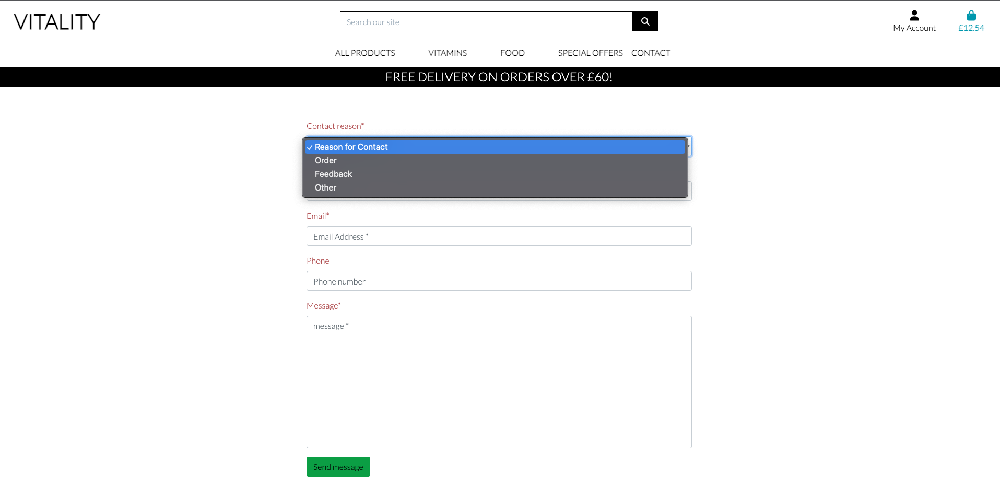
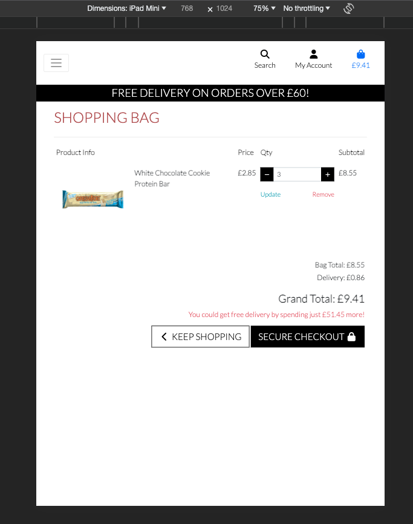

## Testing

## Testing User Stories

#### New User
1. As a new user, I want to be able to navigate to Sign-Up page to register an account.
   - Login/Register features are easily accessible via navigation bar

#### Returning User Goals

1. As a returning user, I want to be able to access my account on the website.
   - feature is available via 'Account' on navigation bar. User can view their profile and order history.
2. View my previous orders, to keep a record of my transaction.
3. Edit default information, to update any necessary fields.
   - this feature is available in Profiles as well as in the checkout where user can edit tgeir details.
4. View shopping bag to get an overview of products I wish to order.
   - feature is available in bag, where user can view order, quantity, total amount and delivery amount.
5. Remove products from my bag.
6. Update a product's quantity.
7. Proceed to a secure checkout, to make a purchase.
   - removing/updating and checkout are avialble in the shopping bag 
8. Have clear visual feedback of the order process, to understand all steps of the process.
   - FAQs are avialle to answer questions that user may have.
10. Be able to edit my bag at all times, to allow change of mind.
    - available in the bag, where user can adjust quantity
11. Receive a summary of my order via email to confirm that my transaction has been process.
    - feature available and included after checkout.

#### User

1. View all products, to purchase my desired items.
   - products are accessable through a navigation bar, where user can also use categories to view only specific products.
2. Filter through categories, to only see relevant products.
3. Use a search query, to find a specific product or product type.
   - search bar is functional and allows user to view specific products 
4. Add items to my shopping bag, to begin the order process.
   Adding item to bag is available after clicking into a product of interest
5. Receive visual feedback that my item has been added to the bag, to confirm my selection.
   - toasts are used to give live feedback to the user
6. View contact informtation for the shop
   - contact information are available in the footer as well as in the nav bar under 'Contact Us'
7. Navigate to a page that could help me with my enquiry, to answer my question.
   - navigation of the page is easy and intuitive.

## Manual Testing

### Common Elements Testing

Manual testing was conducted on the following elements that appear on every page:

- Clicking on the navigation bar menu items to take the user to the correct page on the
  website
- Clicking on the footer items to take the user to the correct page on the
website
Facebook
Twitter
Instagram

### Home Page

Manual testing was conducted on the following elements of the [Home Page](index.html):

- The responsiveness of the page

  

- Navigation bar changes into a dropdown menu on smaller screens

  

- Footer is visible and functionable, with links and layout working on all screens.

  

- 'Shop Now' button will take user to all products section of the shop

  

- Search bar will search products based on name and description

  

- Products are divided by categories on the nav-bar and take the user to the right page annd show correct products.

  

- "My Account" page gives the user opportunity to log in /register

  

- Upon logging in "My Account button shows relevant options for logged in user, like Profiles and Product Management for superusers

  

- Bag updates with correct amount to reflect products added to the bag

  

- Users get feedback via toasts upon updating the basket

  

### Products Page

Manual testing was conducted on the following elements of the [Products Page](products.html):

- The responsiveness of the page

  

- Various options to sort products by

  

- Scrollable page with product pictures and names

  

- Edit/Delete buttons available for superuser

  

### Product detail Page

Manual testing was conducted on the following elements of the [Product detail Page](product_detail.html):

- The responsiveness of the page

  

- Product description, price, category and name visible on the page

  

- Ability to add different quantity of product to the bag + add to bag button

  

### Contact page 

Manual testing was conducted on the following elements of the [Contact Page](contact.html):

- The responsiveness of the page

  

- Fully functional form with required fields and send button

  

- Reason for contact is a collabsable option

  

### FAQs Page

Manual testing was conducted on the following elements of the [FAQ Page](faq.html):

- The responsiveness of the page

  

- Collabsable Answers option and Question with show/hide text button - all functional

  
  

### Shopping Bag Page

Manual testing was conducted on the following elements of the [Bag Page](bag.html):

- The responsiveness of the page

  

- Product is visible including price, quantity, delivery fee etc.

  

- Quantity can be adjusted via the buttons in the bag 

  

- secure checkout available

  

### Product Management

Manual testing was conducted on the following elements of the [product Management Page](add_product.html):

- The responsiveness of the page

  

- Functional form with submit button

  

### Edit Product

Manual testing was conducted on the following elements of the [Edit Product Page](edit_product.html):

- The responsiveness of the page

  

### Profile

Manual testing was conducted on the following elements of the [Profile Page](profile.html):

- The responsiveness of the page

  

- Ability to view and update information via a form

  

### Log/Register

Manual testing was conducted on the following elements of the [Log in/Register Page]:

- The responsiveness of the page

  

- Registration form

  

- Log in 

  

## Automated Testing

Both manual and automated testing are used to check if the project's code is written in a way the project works correctly.
Automated testing can be performed via a Python testing framework like Pytest. I am aware of the advantages the automated testing carries like high reliability, as it is run and performed by a programme as the code is developed and it is a lot quicker as hundreds of tests can be performed against the project in a short time frame.
Although more time-consuming, I have decided to utilise the manual way of testing as the project is quite small and I didn’t have the time capacity in the project window to get automated testing set up correctly.
Manual testing checks if the project works by user stories by testing it in different browsers and resolutions. The testing can be performed manually by a potential user, code creator or another third party.

In a real-life scenario, I fully acknowledge I would use PyTest to further practice my skills with automated testing and make sure that errors are picked up early and corrected promptly.

### Code Validation

The [W3C Markup Validator](https://validator.w3.org/) service was used to validate the `HTML` and `CSS` code used.
The [Extends Class](https://extendsclass.com/) service was used to validate Python.

**Results:**

- HTML Pages
  

  

- CSS
  

  

### Browser Validation

- Chrome
  

  

- Safari

  

## User testing

A few friends and family members were asked to review the page for user experience and to point out any bugs/issues. The input of this group led to small UX adjustments to improve the overall site appearance and user experience. Some of them included: Improving CSS for better visibility, Changing the footer, Adding FAQs, Changing contact form questions.
DEBUG function was turned off.